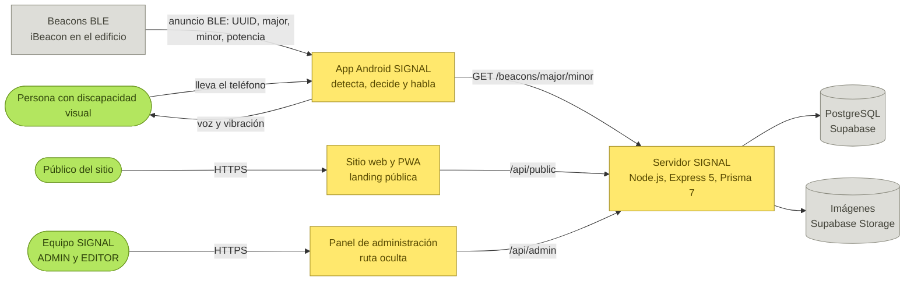
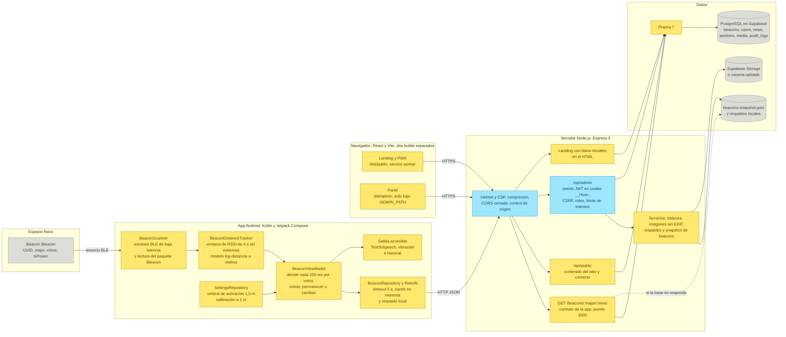
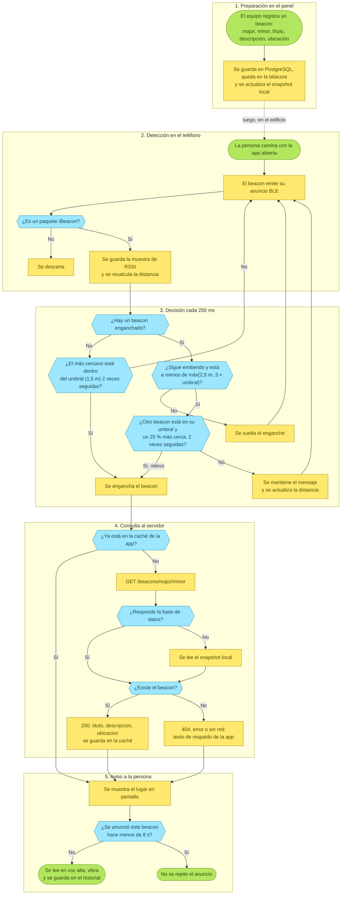

# Diagramas de SIGNAL

Tres diagramas del sistema, también disponibles en el tablero de Miro [SIGNAL · Diagramas del sistema](https://miro.com/app/board/uXjVEen-r6k=/).

Cada diagrama tiene su fuente Mermaid (`.mmd`), que es la que se edita, y dos imágenes generadas a partir de ella (`.svg` y `.png`). GitHub muestra el Mermaid de este archivo directamente.

Para regenerar las imágenes después de editar un `.mmd`:

```bash
cd docs/diagramas
npx -y @mermaid-js/mermaid-cli -b white -i flujo-funcionamiento.mmd -o flujo-funcionamiento.svg
npx -y @mermaid-js/mermaid-cli -b white -s 2 -i flujo-funcionamiento.mmd -o flujo-funcionamiento.png
```

## 1. Arquitectura general

Quiénes usan SIGNAL y cómo se conectan las piezas: los beacons del edificio, la app Android, el sitio público, el panel, el servidor y los datos.



Imagen: [`arquitectura-general.svg`](arquitectura-general.svg) · [`arquitectura-general.png`](arquitectura-general.png)

## 2. Arquitectura estructurada

Los componentes internos de cada pieza: la cadena de la app Android (escaneo BLE, filtro de distancia, decisión y voz), los dos builds del navegador, las capas del servidor y dónde vive cada dato.



Imagen: [`arquitectura-estructurada.svg`](arquitectura-estructurada.svg) · [`arquitectura-estructurada.png`](arquitectura-estructurada.png)

## 3. Flujo de funcionamiento

Desde que el equipo registra un beacon en el panel hasta que la persona escucha dónde está, con las reglas que usa la app para engancharse a un beacon, mantenerlo o cambiar a otro, y los respaldos cuando falla la base de datos o la red.



Imagen: [`flujo-funcionamiento.svg`](flujo-funcionamiento.svg) · [`flujo-funcionamiento.png`](flujo-funcionamiento.png)
