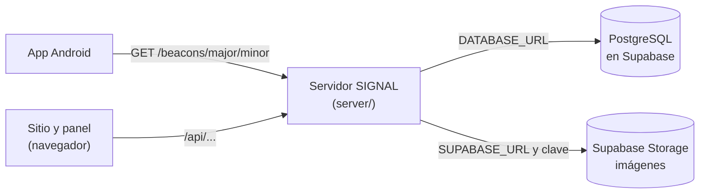

# Conectar SIGNAL con Supabase, paso a paso

Esta guía conecta el servidor de SIGNAL a una base de datos PostgreSQL en Supabase y, de forma opcional, guarda las imágenes del panel en Supabase Storage. Sirve tanto para probar desde tu computador como para el servidor de producción: los pasos son los mismos, solo cambia dónde escribes las variables.

> **Nunca compartas las credenciales.** La contraseña de la base y la clave `service_role` dan acceso total a tus datos. No las pegues en chats, issues, commits ni capturas de pantalla. Solo van en `server/.env` (que git ignora) o en las variables de entorno de la plataforma de despliegue.

## 0. Cómo se conectan las piezas



- **Solo el servidor habla con Supabase.** La app Android y el navegador nunca se conectan directo a la base: piden los datos al servidor.
- Por eso **ninguna credencial de Supabase va en la app Android ni en variables `VITE_*`** del frontend. Todo vive en `server/.env`.
- Si un día la base no responde, el servidor sigue contestando a la app desde su copia local de los beacons (`server/backups/beacons.snapshot.json`).

**Lo que vas a necesitar:**

- una cuenta en [supabase.com](https://supabase.com);
- el repositorio con las dependencias instaladas (`npm ci` en la raíz);
- el archivo `server/.env` (si no existe: `cp server/.env.example server/.env`).

## 1. Crear el proyecto en Supabase

Si ya tienes el proyecto creado, salta al paso 2.

1. Entra a [supabase.com/dashboard](https://supabase.com/dashboard) y pulsa **New project**.
2. Elige tu organización y completa:
   - **Name:** por ejemplo `signal`.
   - **Database Password:** pulsa **Generate a password** o escribe una larga. **Guárdala en tu gestor de contraseñas ahora**: Supabase no la vuelve a mostrar.
     - Consejo: usa solo letras y números. Si tiene símbolos como `@ # / ? % :` tendrás que codificarlos en el paso 3.
   - **Region:** la más cercana a tus usuarios y a tu servidor. Desde Chile, **South America (São Paulo)**.
3. Pulsa **Create new project** y espera a que termine de prepararse (uno o dos minutos).

¿Perdiste la contraseña? En **Project Settings → Database** está **Reset database password**. Al cambiarla, actualiza `server/.env`.

## 2. Entender las dos cadenas de conexión

SIGNAL usa **dos** direcciones de la misma base, porque cada una sirve para algo distinto:

| Variable       | Tipo en Supabase                       | Puerto | Para qué                                                                                   |
| -------------- | -------------------------------------- | ------ | ------------------------------------------------------------------------------------------ |
| `DATABASE_URL` | **Transaction pooler** (modo transacción) | `6543` | El servidor en marcha: muchas consultas cortas, reparte conexiones.                       |
| `DIRECT_URL`   | **Session pooler** (modo sesión)          | `5432` | Solo para crear y actualizar las tablas (`npm run db:deploy`). Las migraciones no funcionan en el puerto 6543. |

No uses la «Direct connection» (`db.<ref>.supabase.co`): solo funciona por IPv6, y muchos computadores y plataformas no tienen IPv6. Los dos poolers funcionan por IPv4.

## 3. Copiar las cadenas de conexión

1. En tu proyecto, pulsa el botón **Connect** de la barra superior. En versiones anteriores del panel está en **Project Settings → Database → Connection string**.
2. Elige la pestaña o el tipo **URI**.
3. Copia la de **Transaction pooler**. Se ve así (los valores entre `< >` son los tuyos):

   ```
   postgresql://postgres.<ref>:[YOUR-PASSWORD]@aws-0-<region>.pooler.supabase.com:6543/postgres
   ```

4. Copia la de **Session pooler**. Es casi igual, pero con el puerto `5432`:

   ```
   postgresql://postgres.<ref>:[YOUR-PASSWORD]@aws-0-<region>.pooler.supabase.com:5432/postgres
   ```

5. En las dos, **reemplaza `[YOUR-PASSWORD]` por tu contraseña**, sin los corchetes.
6. Al final de la de Transaction pooler agrega `?pgbouncer=true`.

Fíjate en tres detalles que causan la mayoría de los errores:

- El usuario es **`postgres.<ref>`** (con el punto y el identificador del proyecto), no solo `postgres`.
- El host empieza con `aws-0-` o `aws-1-` según el proyecto: **cópialo tal cual** desde Supabase, no lo escribas a mano.
- Si la contraseña tiene símbolos, codifícalos: `@` → `%40`, `#` → `%23`, `/` → `%2F`, `?` → `%3F`, `%` → `%25`, `:` → `%3A`. Por ejemplo, `Hola#2026` se escribe `Hola%232026`. Lo más simple es cambiar a una contraseña de solo letras y números.

## 4. Escribir las variables en `server/.env`

Abre `server/.env` y deja así la sección de la base de datos (con tus valores reales):

```bash
# --- Base de datos (Supabase) ---
DATABASE_URL="postgresql://postgres.<ref>:<tu-contraseña>@aws-0-<region>.pooler.supabase.com:6543/postgres?pgbouncer=true"
DIRECT_URL="postgresql://postgres.<ref>:<tu-contraseña>@aws-0-<region>.pooler.supabase.com:5432/postgres"
```

- Usa **comillas dobles** alrededor de cada URL.
- Si tenías la línea de la base local (`localhost:5433`), reemplázala; no dejes dos `DATABASE_URL`.
- `DIRECT_URL` venía comentada con `#` en la plantilla: **quítale el `#`**.
- No toques `TEST_DATABASE_URL`: las pruebas **borran** esa base, así que debe seguir apuntando a una base local terminada en `_test`, **nunca a Supabase**.

**En producción** (Render, Railway, un VPS…) no subas el archivo: crea las mismas variables en el panel de variables de entorno de la plataforma, con el mismo nombre y valor (sin comillas, si la plataforma las agrega sola).

## 5. Crear las tablas

Desde la **raíz del repositorio**:

```bash
npm run db:deploy
```

Debe terminar con algo como:

```
Datasource "db": PostgreSQL database "postgres", schema "public" at "aws-0-<region>.pooler.supabase.com:5432"
...
All migrations have been successfully applied.
```

Comprueba que dice el host de Supabase y el puerto **5432**. Si dice `localhost`, el `.env` no se está leyendo o la variable quedó comentada.

Ahora mira las tablas en Supabase: **Table Editor**. Verás `users`, `beacons`, `news`, `sections`, `site_settings`, `media`, `audit_logs`, `contact_messages`, entre otras.

> **Sobre los avisos de RLS:** Supabase marcará las tablas con «RLS enabled, no policies» o algo parecido en el **Security Advisor**. **Es intencional, no lo «arregles».** La migración activa RLS sin políticas y quita los permisos a los roles públicos (`anon` y `authenticated`) para que nadie pueda leer los datos, incluidos los hashes de contraseñas, con la clave pública del proyecto. El servidor se conecta como dueño de las tablas y no se ve afectado. No crees políticas ni desactives RLS.

## 6. Cargar los datos iniciales

### 6.1 Los beacons

```bash
npm run import:beacons
```

Importa los beacons históricos de `server/prisma/data/beacons.json`. Solo crea los que faltan: si lo ejecutas dos veces, no duplica nada.

### 6.2 Las cuentas del panel y el contenido del sitio

1. En `server/.env`, completa:

   ```bash
   SEED_ADMIN_EMAIL=tu-correo@dominio.cl
   SEED_ADMIN_PASSWORD=una-contraseña-temporal-de-12-o-más
   SEED_EDITOR_EMAIL=correo-del-editor@dominio.cl
   SEED_EDITOR_PASSWORD=otra-contraseña-temporal-de-12-o-más
   ```

2. Ejecuta:

   ```bash
   npm run seed
   ```

   Debe terminar con `Seed completo.`. Crea las dos cuentas (que deberán cambiar la contraseña al entrar por primera vez), la identidad visual por defecto y las secciones del sitio. Es idempotente: no toca lo que ya existe.

3. Cuando entres al panel y cambies las contraseñas, puedes borrar `SEED_ADMIN_PASSWORD` y `SEED_EDITOR_PASSWORD` del `.env`.

### 6.3 ¿Ya tenías datos en la base local?

Si trabajaste con `npm run db:local` y quieres llevar ese contenido a Supabase:

1. **Antes de cambiar el `.env`**, con la base local todavía activa, crea un respaldo:

   ```bash
   npm run backup
   ```

   Anota el nombre del archivo que muestra (queda en `server/backups/`).

2. Cambia el `.env` a Supabase (paso 4) y crea las tablas (paso 5).
3. Revisa el respaldo sin tocar nada:

   ```bash
   npm run restore -- <archivo>
   ```

4. Si es el correcto, restáuralo. **Esto reemplaza todo el contenido de la base de Supabase**:

   ```bash
   npm run restore -- <archivo> --confirmar
   ```

En ese caso no necesitas el paso 6.1 ni el 6.2: el respaldo ya trae los beacons, las cuentas y el contenido.

## 7. Imágenes en Supabase Storage (recomendado en producción)

Sin este paso, las imágenes que subas en el panel se guardan en la carpeta `server/uploads` del servidor. Sirve para probar, pero en muchas plataformas esa carpeta se borra en cada despliegue.

### 7.1 Crear el bucket

1. En Supabase, abre **Storage** y pulsa **New bucket**.
2. **Name:** `media`.
3. Activa **Public bucket**. Las imágenes del sitio son públicas; el servidor es el único que puede subirlas o borrarlas.
4. Pulsa **Create bucket**.

### 7.2 Copiar la URL del proyecto y la clave del servidor

1. **Project Settings → Data API** (o **API**, según la versión del panel): copia la **Project URL**, que se ve como `https://<ref>.supabase.co`.
2. **Project Settings → API Keys**: copia la clave **`service_role`**. Es un texto largo que empieza con `eyJ`. Si el panel separa las claves en pestañas, está en **Legacy API Keys**.
   - **No uses la clave `anon` ni la `publishable`**: no tienen permiso para subir archivos.
   - Si tu proyecto solo ofrece las claves nuevas (`sb_secret_...`), usa la **secret key** y comprueba la subida en el paso 8. Si falla con 401 o 403, pide la clave `service_role` heredada.

### 7.3 Escribir las variables

En `server/.env`:

```bash
STORAGE_DRIVER=supabase
SUPABASE_URL=https://<ref>.supabase.co
SUPABASE_SERVICE_ROLE_KEY=<la-clave-que-copiaste>
SUPABASE_BUCKET=media
```

El servidor agrega solo el dominio de Supabase a la política de seguridad (CSP) para que el navegador pueda mostrar esas imágenes. No hace falta tocar `CSP_IMG_HOSTS`.

## 8. Arrancar y comprobar que todo funciona

1. Compila y arranca, desde la raíz:

   ```bash
   npm run build
   npm start
   ```

   Para desarrollo también sirve `npm run dev`. Si falta o sobra algo en el `.env`, el servidor no arranca y dice qué variable revisar (`Configuración inválida en server/.env: ...`).

2. **Salud de la base.** En otra terminal:

   ```bash
   curl http://localhost:3000/api/health
   ```

   Respuesta esperada: `{"ok":true,"db":"ok"}`. Si dice `"db":"sin conexión"`, revisa `DATABASE_URL` (paso 3).

3. **El endpoint de la app Android:**

   ```bash
   curl http://localhost:3000/beacons/1/1
   ```

   Debe responder la ficha con `titulo`, `descripcion` y `ubicacion`. Un beacon que no existe responde `{"error":"No hay información para el beacon M-m"}`.

4. **El panel:** abre `http://localhost:3000/<ADMIN_PATH>` (el valor de `ADMIN_PATH` en tu `.env`), entra con la cuenta del seed y crea la contraseña definitiva.
5. **Storage** (si hiciste el paso 7): sube una imagen en el panel, por ejemplo en una noticia o en Identidad visual. Luego, en Supabase, **Storage → media** debe mostrar el archivo, y la imagen debe verse en el sitio.

Si todo eso funciona, el servidor ya está conectado a Supabase.

## 9. Conectar la app Android al servidor

La app no cambia por usar Supabase: sigue pidiendo `GET /beacons/:major/:minor` **al servidor**. Lo único que debes revisar es a qué servidor apunta:

1. Abre `BeaconsAndroid/app/src/main/java/com/example/proyectobeacons/data/RetrofitClient.kt`.
2. Cambia `BASE_URL` según el caso:
   - **Pruebas con el servidor en tu computador:** `http://<IP-de-tu-computador>:3000/` (la IP de la red local; en Windows, `ipconfig`). El teléfono debe estar en la misma red Wi-Fi y esa IP debe estar en `network_security_config.xml`.
   - **Servidor desplegado:** `https://tu-dominio/`. Con HTTPS ya no hace falta la excepción de `network_security_config.xml`.
3. Recompila e instala la app.
4. Acércate a un beacon registrado: la app debe leer en voz alta el título y la descripción que guardaste en el panel.

## Problemas frecuentes

| Síntoma                                                                 | Causa probable                                                    | Qué hacer                                                                                           |
| ----------------------------------------------------------------------- | ----------------------------------------------------------------- | --------------------------------------------------------------------------------------------------- |
| `Falta DATABASE_URL (ver server/.env.example)`                         | El archivo no está en `server/.env` o la línea está comentada.    | Verifica la ruta y que la línea no empiece con `#`.                                                  |
| `P1001: Can't reach database server`                                    | Host o puerto mal copiados, o usaste la «Direct connection».      | Copia de nuevo desde **Connect** las URL del pooler (paso 3).                                         |
| `password authentication failed` o `Tenant or user not found`          | Usuario sin `.<ref>`, contraseña equivocada o con símbolos sin codificar. | El usuario es `postgres.<ref>`. Codifica los símbolos o cambia la contraseña (pasos 1 y 3).    |
| `npm run db:deploy` falla o se queda colgado                            | Falta `DIRECT_URL` y está migrando por el puerto 6543.            | Define `DIRECT_URL` con el Session pooler (puerto 5432).                                            |
| `/api/health` responde `"db":"sin conexión"` tras un tiempo sin uso      | Los proyectos gratuitos de Supabase se pausan por inactividad.    | Reanuda el proyecto desde el panel de Supabase. Mientras tanto, la app sigue respondiendo desde el snapshot. |
| Al subir una imagen: `Supabase Storage respondió 400` o `404`          | El bucket no existe o tiene otro nombre.                          | Crea el bucket `media` o ajusta `SUPABASE_BUCKET`.                                                   |
| Al subir una imagen: `Supabase Storage respondió 401` o `403`          | Clave equivocada (`anon` o `publishable`) o mal copiada.          | Usa la `service_role` (paso 7.2).                                                                    |
| La imagen se sube pero no se ve en el sitio                             | El bucket no es público.                                          | En **Storage**, edita el bucket y activa **Public bucket**.                                          |
| `Configuración inválida en server/.env: STORAGE_DRIVER ...`             | `STORAGE_DRIVER=supabase` sin `SUPABASE_URL` o sin la clave.      | Completa las dos variables (paso 7.3).                                                               |

## Si una credencial se filtra

1. **Contraseña de la base:** **Project Settings → Database → Reset database password** y actualiza `DATABASE_URL` y `DIRECT_URL`.
2. **Clave `service_role`:** regenérala o rótala en **Project Settings → API Keys** y actualiza `SUPABASE_SERVICE_ROLE_KEY`.
3. Reinicia el servidor para que tome los valores nuevos.

## Resumen de variables

| Variable                    | Obligatoria                 | Ejemplo de forma                                                                       |
| --------------------------- | --------------------------- | -------------------------------------------------------------------------------------- |
| `DATABASE_URL`              | Sí                          | `postgresql://postgres.<ref>:<clave>@aws-0-<region>.pooler.supabase.com:6543/postgres?pgbouncer=true` |
| `DIRECT_URL`                | Sí, para `db:deploy`        | `postgresql://postgres.<ref>:<clave>@aws-0-<region>.pooler.supabase.com:5432/postgres` |
| `STORAGE_DRIVER`            | No (por defecto `local`)    | `supabase`                                                                             |
| `SUPABASE_URL`              | Solo con Storage            | `https://<ref>.supabase.co`                                                            |
| `SUPABASE_SERVICE_ROLE_KEY` | Solo con Storage            | `eyJ...`                                                                               |
| `SUPABASE_BUCKET`           | No (por defecto `media`)    | `media`                                                                                |

El resto de la configuración de producción (HTTPS, `ADMIN_PATH`, secretos, proxy) está en la sección [Despliegue](../README.md#despliegue) del README.
